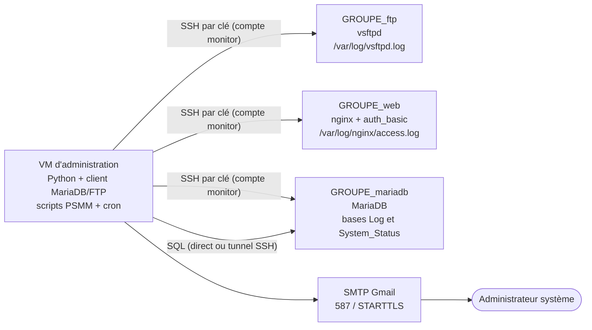

# PSMM — Centralisation des protocoles de gestion d'erreurs

**PSMM** = **P**ython · **S**hell · **M**ariaDB · **M**ail

PSMM est une boîte à outils de supervision et de journalisation de sécurité. Elle collecte les logs de serveurs **FTP**, **SQL** et **Web**, archive les tentatives d'accès invalides dans des bases SQL, surveille les ressources système et alerte l'administrateur par mail.

---

## Sommaire

1. [Présentation](#1-présentation)
2. [Scripts](#2-scripts)
3. [Installation des machines virtuelles](#3-installation-des-machines-virtuelles)
4. [Installation et configuration des services](#4-installation-et-configuration-des-services)
5. [La VM d'administration](#5-la-vm-dadministration)
6. [Configuration du projet](#6-configuration-du-projet)
7. [Sécurité](#7-sécurité)
8. [Description détaillée des scripts](#8-description-détaillée-des-scripts)
9. [Planification (cron)](#9-planification-cron)
10. [Tests et validation](#10-tests-et-validation)
11. [Dépannage](#11-dépannage)
12. [Organisation du dépôt](#12-organisation-du-dépôt)

---

## 1. Présentation

### 1.1 Fonctionnalités

- **Archivage des échecs d'authentification** (compte inconnu ou mot de passe invalide) sur MariaDB, vsftpd et nginx : compte utilisé, date/heure, adresse IP source.
- **Rapport quotidien** par mail : tentatives de connexion de la veille sur les trois services.
- **Supervision RAM / CPU / disque** des serveurs, historique de 72 h, alertes par mail avec seuils configurables et limitation à un mail par heure.
- **Sauvegarde** horodatée de la base, avec conservation des 7 dernières.
- **Mises à jour** des serveurs et notification si un redémarrage est nécessaire.
- **Sécurisation des accès** : SSH par clés, compte dédié, pas de connexion `root`.

### 1.2 Architecture



Une **VM d'administration** joue le rôle de chef d'orchestre : elle se connecte en SSH aux trois serveurs, lit leurs logs et leurs métriques, écrit les résultats dans MariaDB et envoie les mails. Les serveurs n'embarquent aucun script du projet (hormis le dossier de sauvegarde sur la VM MariaDB).

### 1.3 Flux de données

| Flux | Source | Traitement | Destination |
|---|---|---|---|
| Échecs de connexion SQL | `/var/log/mariadb/mariadb.log` | `grep` + regex | `Log.AccessDeniedSQL` |
| Échecs de connexion FTP | `/var/log/vsftpd.log` | `grep` + regex | `Log.AccessDeniedFTP` |
| Échecs d'authentification Web | `/var/log/nginx/access.log` | `grep` + regex | `Log.AccessDeniedWEB` |
| Rapport quotidien | tables `AccessDenied*` | `SELECT` sur la veille | mail |
| Métriques système | `free`, `top`, `df` | calcul de pourcentages | `System_Status.{MariaDB,FTP,WEB}` + mail si seuil |
| Sauvegarde | base `Log` | `mysqldump` + rotation | `/home/<user>/backup/` (sur la VM MariaDB) |

---

## 2. Scripts

| Script | Rôle | Planification conseillée |
|---|---|---|
| `ssh_login.py` | Connexion SSH et exécution d'une commande shell | manuel |
| `ssh_login_sudo.py` | Connexion SSH et exécution d'une commande en `sudo` | manuel |
| `ssh_mysql.py` | Vérification de l'accès au serveur MariaDB | manuel |
| `ssh_mysql_error.py` | Échecs de connexion MariaDB → base `Log` | toutes les heures |
| `ssh_ftp_error.py` | Échecs de connexion FTP → base `Log` | toutes les heures |
| `ssh_web_error.py` | Échecs d'authentification Web → base `Log` | toutes les heures |
| `ssh_serveur_mail.py` | Mail quotidien des tentatives de la veille | 1 fois par jour |
| `ssh_cron_backup.py` | Sauvegarde horodatée, 7 conservées | toutes les 3 h |
| `ssh_system_status.py` | Métriques RAM/CPU/disque, rétention 72 h | — (intégré à `ssh_system_mail.py`) |
| `ssh_system_mail.py` | Métriques + alertes sur seuils, 1 mail/heure maximum | toutes les 5 min |
| `ssh_update.py` | Mises à jour, mail si redémarrage requis | 1 fois par semaine |
| Notification Google Chat *(optionnel)* | Messages d'état dans un Space | périodique |

---

## 3. Installation des machines virtuelles

### 3.1 Caractéristiques

| VM | Nom | RAM | vCPU | Disque | Rôle |
|---|---|---|---|---|---|
| FTP | `<groupe>_ftp` | 1 Go | 1 | 8 Go | Serveur FTP (vsftpd) |
| Web | `<groupe>_web` | 1 Go | 1 | 8 Go | nginx avec authentification basique |
| SQL | `<groupe>_mariadb` | 2 Go | 2 | 8 Go | MariaDB |
| Admin | `<groupe>_admin` | 1 Go | 1 | 8 Go | Scripts Python, sans interface graphique |

> Les noms de VM de l'hyperviseur suivent la convention `<groupe>_<fonction>` (ex. `nextgeneration_ftp`). Les **noms d'hôte Linux** ne peuvent pas contenir de `_` : utiliser `nextgeneration-ftp`.

### 3.2 Installation de Debian

Debian 12 « bookworm » ou 13 « trixie » (netinst). **Python ≥ 3.10** est requis (le script de sauvegarde utilise l'instruction `match`) : c'est le cas de ces deux versions.

À l'installation, pour chaque VM :

1. Installation **non graphique** : décocher l'environnement de bureau ; cocher « serveur SSH » et « utilitaires usuels du système ».
2. Partitionnement guidé, disque entier, « tout dans une seule partition ». En BIOS/MBR la racine est `/dev/sda1`, valeur attendue par les scripts de supervision (voir [§6](#6-configuration-du-projet)).
3. Définir un mot de passe `root` robuste (il ne sert jamais en SSH) et créer l'utilisateur `monitor`.

Après installation :

```bash
# En root, sur chaque VM
apt update && apt full-upgrade -y
apt install -y sudo ufw curl ca-certificates
hostnamectl set-hostname <groupe>-ftp          # ou -web, -mariadb, -admin
timedatectl set-timezone Europe/Paris
timedatectl set-ntp true                       # heure synchronisée entre les machines
```

### 3.3 Réseau

Les VM sont placées sur le réseau de la plateforme (carte réseau de l'hyperviseur). Pour des scripts qui ciblent des IP fixes, configurer une IP statique :

```ini
# /etc/network/interfaces  (adapter le nom d'interface avec `ip a`)
auto ens33
iface ens33 inet static
    address 10.30.1.76/24
    gateway <IP_PASSERELLE>
```

```bash
systemctl restart networking
```

> `ens33` est le nom d'interface typique sous VMware ; sous VirtualBox ou KVM, vérifier avec `ip -br a` (`enp0s3`, `ens18`…). Ce nom est aussi utilisé par `ssh_update.py`.

### 3.4 Compte `monitor` et SSH par clés

Règles appliquées : **pas de SSH pour `root`**, **seul `monitor` peut se connecter**, **clés SSH uniquement**, `monitor` membre du **groupe `sudo`**.

**a) Créer le compte (sur les 3 serveurs)**

```bash
adduser monitor
usermod -aG sudo monitor
```

**b) Générer une clé sur la VM d'administration**

```bash
ssh-keygen -t ed25519 -C "psmm-admin" -f ~/.ssh/id_ed25519
chmod 600 ~/.ssh/id_ed25519
```

Les scripts s'exécutent sous `cron` sans terminal : la clé doit être utilisable sans saisie de passphrase (ou via un agent). Elle est protégée par ses droits (`600`) et par la restriction d'IP décrite en f).

**c) Déployer la clé publique sur chaque serveur, avant de désactiver les mots de passe**

```bash
ssh-copy-id -i ~/.ssh/id_ed25519.pub monitor@<IP_FTP>
ssh-copy-id -i ~/.ssh/id_ed25519.pub monitor@<IP_WEB>
ssh-copy-id -i ~/.ssh/id_ed25519.pub monitor@<IP_SQL>
ssh monitor@<IP_SQL> hostname      # doit répondre sans mot de passe
```

**d) Durcir `sshd` (sur chaque serveur, en root)**

Debian charge les fichiers `/etc/ssh/sshd_config.d/*.conf` : la configuration y est placée sans modifier le fichier principal.

```bash
cat > /etc/ssh/sshd_config.d/10-psmm.conf <<'EOF'
PermitRootLogin no
PasswordAuthentication no
KbdInteractiveAuthentication no
PubkeyAuthentication yes
PermitEmptyPasswords no
AllowUsers monitor
MaxAuthTries 3
LoginGraceTime 30
X11Forwarding no
EOF

sshd -t && systemctl reload ssh      # vérifie la syntaxe puis recharge
```

> Conserver une session SSH ouverte pendant le test. Sur la VM MariaDB, ne pas désactiver `AllowTcpForwarding` : le tunnel SSH vers MariaDB en a besoin.

**e) Vérifier**

```bash
ssh root@<IP_SQL>                                         # refusé
ssh -o PubkeyAuthentication=no monitor@<IP_SQL>           # refusé (pas de mot de passe)
ssh monitor@<IP_SQL> 'sudo -l'                            # monitor est bien sudoer
```

**f) Restreindre la clé à la VM d'administration**

Dans `~monitor/.ssh/authorized_keys` de chaque serveur, préfixer la clé par l'IP source autorisée :

```text
from="<IP_VM_ADMIN>" ssh-ed25519 AAAAC3... psmm-admin
```

### 3.5 Pare-feu (ufw)

À adapter par VM. Autoriser SSH **avant** d'activer ufw.

```bash
# Commun
ufw default deny incoming
ufw default allow outgoing
ufw allow from <IP_VM_ADMIN> to any port 22 proto tcp

# VM FTP
ufw allow 21/tcp
ufw allow 40000:40100/tcp          # ports passifs (voir §4.1)

# VM Web
ufw allow 80/tcp                   # (+ 443/tcp si TLS)

# VM MariaDB : uniquement pour une connexion SQL directe (sans tunnel SSH)
ufw allow from <IP_VM_ADMIN> to any port 3306 proto tcp

ufw enable
```

---

## 4. Installation et configuration des services

### 4.1 Serveur FTP — vsftpd

```bash
apt install -y vsftpd
```

`/etc/vsftpd.conf` :

```ini
listen=NO
listen_ipv6=YES
anonymous_enable=NO
local_enable=YES
write_enable=YES
chroot_local_user=YES
allow_writeable_chroot=YES

# Journalisation au format vsftpd (fait apparaître les « FAIL LOGIN »)
xferlog_enable=YES
xferlog_std_format=NO
vsftpd_log_file=/var/log/vsftpd.log

# Ports passifs (à ouvrir dans le pare-feu, voir §3.5)
pasv_min_port=40000
pasv_max_port=40100
```

```bash
adduser ftpuser                       # compte de test
systemctl restart vsftpd && systemctl enable vsftpd
```

Notes de configuration :

- Avec `listen=NO` / `listen_ipv6=YES` (valeurs par défaut Debian), les clients IPv4 sont journalisés sous la forme `::ffff:10.30.1.5` ; `ssh_ftp_error.py` s'appuie sur ce format.
- Vérification : `sudo tail -f /var/log/vsftpd.log` pendant une tentative de connexion invalide. Une ligne `... FAIL LOGIN: Client "::ffff:..."` doit apparaître.
- Le FTP classique transmet identifiants et données en clair : pour un usage réel, activer FTPS (`ssl_enable=YES`, certificat, `force_local_logins_ssl=YES`) ou utiliser SFTP. FileZilla et `lftp` gèrent le FTP sur TLS explicite.

### 4.2 Serveur Web — nginx avec authentification basique

```bash
apt install -y nginx apache2-utils      # apache2-utils fournit htpasswd
htpasswd -c /etc/nginx/.htpasswd webuser
chmod 640 /etc/nginx/.htpasswd && chown root:www-data /etc/nginx/.htpasswd
```

`/etc/nginx/sites-available/psmm` :

```nginx
server {
    listen 80 default_server;
    server_name _;
    root /var/www/html;
    index index.html;

    location / {
        auth_basic           "Zone protégée";
        auth_basic_user_file /etc/nginx/.htpasswd;
    }

    access_log /var/log/nginx/access.log;    # format « combined » par défaut
    error_log  /var/log/nginx/error.log;
}
```

```bash
rm -f /etc/nginx/sites-enabled/default
ln -s /etc/nginx/sites-available/psmm /etc/nginx/sites-enabled/psmm
nginx -t && systemctl reload nginx
echo "<h1>PSMM</h1>" > /var/www/html/index.html
```

Test : `curl -u mauvais:mdp http://<IP_WEB>/` renvoie `401 Unauthorized` et ajoute une ligne dans `/var/log/nginx/access.log` :

```text
10.30.1.5 - mauvais [04/Oct/2026:09:42:00 +0200] "GET / HTTP/1.1" 401 574 "-" "curl/7.88.1"
```

> L'authentification basique n'est que du Base64 : sans HTTPS, le mot de passe circule en clair. Un certificat (auto-signé via `apt install ssl-cert` : `listen 443 ssl; ssl_certificate /etc/ssl/certs/ssl-cert-snakeoil.pem; ssl_certificate_key /etc/ssl/private/ssl-cert-snakeoil.key;`) est recommandé.

### 4.3 Serveur SQL — MariaDB

```bash
apt install -y mariadb-server
mariadb-secure-installation
```

**a) Journal d'erreurs lu par `ssh_mysql_error.py`** — `/etc/mysql/mariadb.conf.d/50-server.cnf`, section `[mysqld]` :

```ini
log_error    = /var/log/mariadb/mariadb.log
bind-address = 127.0.0.1        # avec tunnel SSH ; sinon l'IP du serveur + pare-feu
```

```bash
mkdir -p /var/log/mariadb && chown mysql:mysql /var/log/mariadb && chmod 750 /var/log/mariadb
systemctl restart mariadb
```

Sur les versions courantes, les refus de connexion (`Access denied for user …`) sont écrits dans ce journal avec le niveau de verbosité par défaut (`log_warnings=2`, vérifiable avec `SHOW VARIABLES LIKE 'log_warnings';`). Vérification :

```bash
mariadb -u inconnu -pfaux            # tentative volontairement invalide
sudo grep -B1 'Access denied' /var/log/mariadb/mariadb.log | tail
```

Adapter `/etc/logrotate.d/mariadb` au chemin du journal pour assurer sa rotation.

**b) Bases et tables**

```sql
CREATE DATABASE IF NOT EXISTS Log           CHARACTER SET utf8mb4;
CREATE DATABASE IF NOT EXISTS System_Status CHARACTER SET utf8mb4;

-- Tentatives refusées (une table par service)
CREATE TABLE Log.AccessDeniedSQL (
  id          INT AUTO_INCREMENT PRIMARY KEY,
  utilisateur VARCHAR(255) NOT NULL,
  IP          VARCHAR(45)  NOT NULL,
  date        DATETIME     NOT NULL,
  UNIQUE KEY uniq_tentative (utilisateur, IP, date)
);
CREATE TABLE Log.AccessDeniedFTP LIKE Log.AccessDeniedSQL;
CREATE TABLE Log.AccessDeniedWEB LIKE Log.AccessDeniedSQL;

-- Métriques système (une table par serveur)
CREATE TABLE System_Status.MariaDB (
  id        INT AUTO_INCREMENT PRIMARY KEY,
  Memory    VARCHAR(50),     -- ex. « 412.0/3999.0MB »
  MemoryPer VARCHAR(10),     -- ex. « 10.3% »
  CPU       VARCHAR(10),     -- ex. « 4.1% »
  Disk      VARCHAR(60),     -- ex. « 2.4/8.0Gb (30.0%) »
  date      DATETIME
);
CREATE TABLE System_Status.FTP LIKE System_Status.MariaDB;
CREATE TABLE System_Status.WEB LIKE System_Status.MariaDB;
```

La clé `UNIQUE (utilisateur, IP, date)` rend l'import **idempotent** : les scripts d'erreurs relisent l'intégralité du log à chaque exécution et utilisent `INSERT IGNORE`, la contrainte évite les doublons. La colonne `id` en première position est attendue par `ssh_serveur_mail.py`.

**c) Utilisateur applicatif (moindre privilège)**

```sql
CREATE USER 'monitor'@'localhost'  IDENTIFIED BY '<mot_de_passe_fort_dédié>';
CREATE USER 'monitor'@'127.0.0.1'  IDENTIFIED BY '<mot_de_passe_fort_dédié>';
-- Connexion directe depuis la VM admin (sans tunnel), ajouter aussi :
-- CREATE USER 'monitor'@'<IP_VM_ADMIN>' IDENTIFIED BY '<mot_de_passe_fort_dédié>';

GRANT SELECT, INSERT, LOCK TABLES ON Log.*           TO 'monitor'@'localhost', 'monitor'@'127.0.0.1';
GRANT SELECT, INSERT, DELETE      ON System_Status.* TO 'monitor'@'localhost', 'monitor'@'127.0.0.1';
FLUSH PRIVILEGES;
```

`INSERT` (archivage des erreurs, métriques), `SELECT` (rapport quotidien, `mysqldump`), `LOCK TABLES` (`mysqldump`), `DELETE` (purge à 72 h). Aucun droit d'administration.

**d) Dossier de sauvegarde, sur la VM MariaDB**

```bash
mkdir -p /home/<user>/backup && chown monitor:monitor /home/<user>/backup && chmod 700 /home/<user>/backup
```

---

## 5. La VM d'administration

Debian **sans interface graphique**, avec Python, les outils MariaDB (client seul), un client FTP et la bibliothèque standard Python pour l'envoi de mails.

```bash
sudo apt install -y python3 python3-venv python3-pip \
    python3-paramiko python3-pymysql python3-regex \
    mariadb-client ftp lftp openssh-client cron git
```

| Paquet | Utilité |
|---|---|
| `python3-paramiko` | SSH natif en Python (sauvegarde, supervision, mises à jour) |
| `python3-pymysql` | Connexion SQL |
| `python3-regex` | Module `regex` (lookbehind de longueur variable) |
| `mariadb-client` | Client `mariadb` pour les tests manuels |
| `ftp`, `lftp` | Clients FTP en ligne de commande |
| `openssh-client` | Commande `ssh` appelée par les scripts |
| `cron` | Planification |

L'envoi de mail repose sur `smtplib` et `email` (bibliothèque standard).

**Alternative avec environnement virtuel** (Debian refuse `pip install` global : `externally-managed-environment`) :

```bash
python3 -m venv ~/PSMM/venv
~/PSMM/venv/bin/pip install paramiko pymysql regex
# dans cron : ~/PSMM/venv/bin/python3 script.py
```

**Arborescence sur la VM d'administration**

```text
/home/<user>/PSMM/
├── config.ini            # secrets — hors Git, chmod 600
├── last_mail.txt         # horodatage du dernier mail d'alerte (créé automatiquement)
├── logs/                 # sorties de cron
└── ssh_*.py
```

```bash
mkdir -p ~/PSMM/logs
```

**Enregistrer les empreintes des serveurs** (nécessaire aux scripts qui appellent la commande `ssh`, qui ne peut pas poser de question sans terminal) :

```bash
ssh-keyscan -H <IP_FTP> <IP_WEB> <IP_SQL> >> ~/.ssh/known_hosts
```

---

## 6. Configuration du projet

### 6.1 Le fichier `config.ini`

Tous les scripts lisent `/home/<user>/PSMM/config.ini` :

```ini
[MariaDB]
SSH = monitor@10.30.1.76
distanthost = 10.30.1.76
user = monitor
password = <mot_de_passe>

[FTP]
SSH = monitor@<IP_FTP>
distanthost = <IP_FTP>
user = monitor
password = <mot_de_passe>

[WEB]
SSH = monitor@<IP_WEB>
distanthost = <IP_WEB>
user = monitor
password = <mot_de_passe>

[SMTP]
host = smtp.gmail.com
user = <compte_gmail>
password = <mot_de_passe_application_gmail>
```

| Clé | Utilisée par | Signification |
|---|---|---|
| `SSH` | commande `ssh` (erreurs, tunnel SQL) | cible au format `utilisateur@hôte` |
| `distanthost` | paramiko, pymysql | adresse IP du serveur |
| `user` | paramiko, pymysql | compte SSH et compte MariaDB |
| `password` | `sudo -S`, pymysql, `mysqldump` | mot de passe sudo et mot de passe MariaDB |

Règles du format `configparser` :

- les commentaires se placent **sur leur propre ligne** (un commentaire après une valeur en ferait partie) ;
- éviter le caractère `%` dans les mots de passe (ou le doubler : `%%`).

```bash
chmod 600 ~/PSMM/config.ini
```

### 6.2 Éléments à adapter

| Élément | Où | Détail |
|---|---|---|
| Chemin `/home/<user>/PSMM/config.ini` | tous les scripts | à adapter à l'utilisateur de la VM admin : `sed -i 's#/home/esiwok#/home/<user>#g' *.py` |
| IP cible | `ssh_login.py`, `ssh_login_sudo.py`, `ssh_mysql.py` | IP d'un des serveurs |
| `sender_email`, `receiver_email` | `ssh_serveur_mail.py`, `ssh_system_mail.py`, `ssh_update.py` | expéditeur et administrateur destinataire |
| Mot de passe SMTP | `config.ini` | **mot de passe d'application** Gmail (validation en 2 étapes requise) |
| Bases / tables | scripts SQL | `Log`, `System_Status`, `AccessDenied{SQL,FTP,WEB}`, `{MariaDB,FTP,WEB}` |
| Chemins de logs | scripts d'erreurs | `/var/log/mariadb/mariadb.log`, `/var/log/vsftpd.log`, `/var/log/nginx/access.log` |
| Dossier de sauvegarde | `ssh_cron_backup.py` | `/home/<user>/backup/` sur la VM MariaDB |
| Partition | scripts de supervision | `/dev/sda1` par défaut |
| Interface réseau | `ssh_update.py` | `ens33` par défaut |
| Seuils `alertCPU`, `alertRAM`, `alertDISK` | `ssh_system_mail.py` | **70 / 80 / 90 %** |
| Délai anti-répétition `delay` | `ssh_system_mail.py` | 3600 s (1 mail par heure) |
| Fichier d'état `mailtime` | `ssh_system_mail.py` | `/home/<user>/PSMM/last_mail.txt` |

---

## 7. Sécurité

### 7.1 Principes appliqués

| Mesure | Détail |
|---|---|
| Pas de SSH `root` | `PermitRootLogin no` |
| Un seul compte autorisé | `AllowUsers monitor` |
| Authentification par clés | mots de passe SSH désactivés |
| Séparation des rôles | collecte et analyse depuis une VM dédiée ; les serveurs n'exécutent aucun script du projet |
| Requêtes SQL paramétrées | toutes les valeurs passent par `%s` : une valeur issue d'un log (contrôlée par un attaquant) ne peut pas injecter de SQL |
| Mails en texte brut | pas d'interprétation HTML des noms d'utilisateurs hostiles |
| SMTP chiffré | `STARTTLS` avant `login()` |
| Rétention maîtrisée | 7 sauvegardes, 72 h de métriques |
| Détection | refus de connexion archivés, alertes de ressources |

### 7.2 Durcissement complémentaire

**Sudo limité aux commandes nécessaires, sans mot de passe stocké**

```bash
# visudo -f /etc/sudoers.d/psmm    (à adapter par serveur)
# Serveur MariaDB
monitor ALL=(root) NOPASSWD: /usr/bin/grep -B1 Access\ denied /var/log/mariadb/mariadb.log
# Serveur FTP
monitor ALL=(root) NOPASSWD: /usr/bin/grep FAIL\ LOGIN /var/log/vsftpd.log
# Serveur Web
monitor ALL=(root) NOPASSWD: /usr/bin/grep 401\ 574 /var/log/nginx/access.log
# Mises à jour (tous les serveurs)
monitor ALL=(root) NOPASSWD: /usr/bin/apt update, /usr/bin/apt upgrade -y, /usr/bin/systemctl restart networking
```

Chaque règle doit correspondre exactement aux arguments passés par le script (vérification avec `sudo -l`). Pour lire les logs nginx, ajouter `monitor` au groupe `adm` suffit également (`usermod -aG adm monitor`) : sous Debian ce groupe lit `/var/log/nginx/*.log` sans `sudo`.

**Secrets**

- Utiliser des mots de passe **distincts** pour sudo, MariaDB et SMTP.
- Ne jamais versionner `config.ini` (voir [§12](#12-organisation-du-dépôt)) ; ne laisser aucun identifiant ni adresse personnelle dans les `.py`.
- Gmail : utiliser un **mot de passe d'application**, révocable séparément.
- Pour `mysqldump`, préférer un fichier d'options protégé à un mot de passe en argument (visible dans `ps`) :

```bash
# ~monitor/.my.cnf  (chmod 600)
[client]
user=monitor
password=<mot_de_passe>
```
puis `mysqldump --single-transaction Log > …` sans `-u` ni `-p`.

**Vérification des empreintes SSH**

Avec paramiko, charger les empreintes connues et refuser les inconnues :

```python
client.load_system_host_keys()
client.set_missing_host_key_policy(paramiko.RejectPolicy())
```

`~/.ssh/known_hosts` doit alors avoir été peuplé (voir [§5](#5-la-vm-dadministration)).

**MariaDB**

- `bind-address=127.0.0.1` + **tunnel SSH** : le port 3306 n'est jamais exposé sur le réseau. Sinon : pare-feu limité à l'IP de la VM admin et utilisateur `'monitor'@'<IP_VM_ADMIN>'`.
- Compte applicatif sans droits d'administration (voir [§4.3](#43-serveur-sql--mariadb)).
- Sauvegardes : dossier en `chmod 700` ; copie régulière des `.sql` hors de la VM.

**Services exposés**

- FTPS/SFTP pour le FTP, HTTPS pour l'authentification basique.
- Pare-feu `ufw` par VM ([§3.5](#35-pare-feu-ufw)).
- `fail2ban` (optionnel) contre le brute-force ; ajouter les postes de test dans `ignoreip`.

**Système**

- Mises à jour régulières (`ssh_update.py`), heure synchronisée (NTP), `logrotate` pour les journaux lus par les scripts.
- Tâches planifiées protégées par `flock` contre les exécutions concurrentes (voir [§9](#9-planification-cron)).

---

## 8. Description détaillée des scripts

### 8.1 `ssh_login.py`

Ouvre une session SSH sur un serveur et exécute une commande shell.

```python
import os
os.system('ssh monitor@10.30.1.76 "ls -la"')
```

- `os.system` lance la commande `ssh monitor@10.30.1.76 "ls -la"`.
- L'authentification utilise la clé privée de l'utilisateur local, sans mot de passe.
- La sortie de la commande (ici le contenu du dossier personnel de `monitor`) s'affiche dans le terminal. La commande entre guillemets est librement remplaçable (`df -h`…).

**Prérequis** : clé déployée ([§3.4](#34-compte-monitor-et-ssh-par-clés)), empreinte du serveur dans `known_hosts`.

---

### 8.2 `ssh_login_sudo.py`

Exécute une commande **en `sudo`** sur le serveur distant.

```python
os.system('ssh -t monitor@10.30.1.76 "sudo whoami"')
```

- `-t` alloue un pseudo-terminal, ce qui permet à `sudo` de demander le mot de passe de `monitor`.
- Résultat attendu : `root`, ce qui confirme que `monitor` appartient au groupe `sudo`.
- Ce mode est interactif. Pour les exécutions planifiées, les scripts suivants utilisent `sudo -S` (mot de passe lu sur l'entrée standard) via `subprocess.run(..., input=…)` ou paramiko.

---

### 8.3 `ssh_mysql.py`

Vérifie l'accès au serveur MariaDB avec les paramètres de `config.ini`.

```python
import configparser, pymysql

config = configparser.ConfigParser()
config.read("/home/<user>/PSMM/config.ini")

connexion = pymysql.connect(
    host=config["MariaDB"]["distanthost"],
    user=config["MariaDB"]["user"],
    password=config["MariaDB"]["password"],
    charset="utf8mb4",
)
with connexion.cursor() as curseur:
    curseur.execute("SELECT VERSION()")
    print("Connexion MariaDB OK — version :", curseur.fetchone()[0])
    curseur.execute("SHOW DATABASES")
    print("Bases visibles :", [ligne[0] for ligne in curseur.fetchall()])
connexion.close()
```

Sortie attendue : la version du serveur et la liste des bases visibles par `monitor` (au minimum `Log` et `System_Status`).

---

### 8.4 `ssh_mysql_error.py`

Extrait du journal de MariaDB les tentatives de connexion refusées et les archive dans `Log.AccessDeniedSQL` (compte, IP source, date/heure).

**Fonctionnement**

1. Lecture de `config.ini`.
2. Récupération des lignes à distance :
   ```python
   grep = subprocess.run(
       ["ssh", config["MariaDB"]["SSH"],
        "sudo -S grep -B1 'Access denied' /var/log/mariadb/mariadb.log"],
       input=config["MariaDB"]["password"], capture_output=True, text=True)
   ```
   - `ssh` exécute `sudo grep` sur la VM MariaDB (le journal n'est lisible que par `root`/`mysql`).
   - `sudo -S` lit le mot de passe sur l'entrée standard (`input=`) ; le prompt part sur `stderr` et ne pollue pas `stdout`.
   - `-B1` ajoute la ligne précédente à chaque correspondance ; les groupes sont séparés par `--`, ignoré par le script.
3. Connexion à la base `Log` (`pymysql`, UTF-8 étendu).
4. Analyse ligne par ligne avec trois regex :

   | Donnée | Regex | Détail |
   |---|---|---|
   | Date | `\b2\d{5}\b \d{2}:\d{2}:\d{2}` | format `AAMMJJ HH:MM:SS`, converti en `AAAA-MM-JJ HH:MM:SS` via `time.strptime` |
   | Compte | `[^@\s]+(?=@)` | texte avant le `@` |
   | IP | `(?<=@)[^@\s]+(?= on)` | texte entre `@` et ` on` |

   Une ligne où l'une des trois informations manque est ignorée.
5. Insertion paramétrée :
   `INSERT IGNORE INTO AccessDeniedSQL (utilisateur, IP, date) VALUES (%s, %s, %s)`.
6. `commit()`, fermeture, affichage de `Finished !`.

**Résultat** : une ligne par tentative refusée. Grâce à `INSERT IGNORE` et à la clé `UNIQUE`, le script peut être relancé sans créer de doublons.

**Hypothèses d'environnement** : format de journal MariaDB correspondant aux regex (à comparer à une ligne réelle de `sudo grep -B1 'Access denied' /var/log/mariadb/mariadb.log` selon la version de MariaDB).

---

### 8.5 `ssh_ftp_error.py`

Même principe que `ssh_mysql_error.py`, pour le journal **vsftpd** ; écriture dans `Log.AccessDeniedFTP`.

- Commande distante : `sudo -S grep 'FAIL LOGIN' /var/log/vsftpd.log` (section `[FTP]`).
- Ligne de log typique :
  ```text
  Sun Oct 04 09:42:00 2026 [pid 1234] [bob] FAIL LOGIN: Client "::ffff:10.30.1.5"
  ```
- Regex :

  | Donnée | Regex | Conversion |
  |---|---|---|
  | Date | `\D{3} \D{3} \d{2} \d{2}:\d{2}:\d{2} \d{4}` | `strptime("%a %b %d %H:%M:%S %Y")` |
  | Compte | `(?<=\[)\w+(?=\] FAIL)` | nom entre crochets avant `FAIL` |
  | IP | `(?<=::ffff:)[\d.]+(?=\")` | IPv4 après le préfixe `::ffff:` |

- Chaque date / compte / IP extrait est affiché, ce qui facilite le suivi d'exécution.

**Hypothèses d'environnement** : `xferlog_std_format=NO` et `listen_ipv6=YES` ([§4.1](#41-serveur-ftp--vsftpd)) ; les noms de jours et de mois (`%a`, `%b`) sont lus selon la locale de la VM d'administration : sous cron (locale `C`) ils sont reconnus ; en exécution manuelle, utiliser `LC_ALL=C python3 ssh_ftp_error.py`.

---

### 8.6 `ssh_web_error.py`

Extrait les échecs d'authentification HTTP de nginx ; écriture dans `Log.AccessDeniedWEB`.

- Commande distante : `sudo -S grep '401 574' /var/log/nginx/access.log` (section `[WEB]`) : requêtes de statut `401` avec une réponse de 574 octets.
- Utilise le module **`regex`** (et non `re`), qui accepte les *lookbehind* de longueur variable (`(?<=\S{7,39} - )`).
- Ligne de log (format `combined`) :
  ```text
  10.30.1.5 - mauvais [04/Oct/2026:09:42:00 +0200] "GET / HTTP/1.1" 401 574 "-" "curl/7.88.1"
  ```
- Extraction :

  | Donnée | Principe | Détail |
  |---|---|---|
  | IP | `^\S{7,39}(?= - .+ \[)` | début de ligne, de 7 à 39 caractères (de `1.1.1.1` à une IPv6 complète) |
  | Compte | texte entre `<IP> - ` et ` [date` | champ `$remote_user` : le login saisi |
  | Date | `\d{2}/[A-Za-z]{3}/\d{4}:\d{2}:\d{2}:\d{2}` suivi de `+hhmm] "GET` | `strptime("%d/%b/%Y:%H:%M:%S")`, fuseau ignoré |

**Hypothèses d'environnement** : nginx au format de log `combined` ; requêtes `GET` ; locale `C` pour `%b` (voir `ssh_ftp_error.py`).

---

### 8.7 `ssh_serveur_mail.py`

Envoie à l'administrateur un mail récapitulant les tentatives refusées de **la veille** sur les trois services.

1. Lecture de `config.ini` ; paramètres SMTP : serveur (`[SMTP] host`), port `587`, identifiants.
2. Calcul de la date de la veille :
   ```python
   yesterday = (datetime.datetime.now() - datetime.timedelta(days=1)).strftime('%Y-%m-%d')
   ```
3. Une requête par table :
   ```sql
   SELECT * FROM AccessDeniedSQL WHERE DATE(date)=%s
   ```
   (idem pour `AccessDeniedFTP` et `AccessDeniedWEB`).
4. Mise en forme : `utilisateur depuis IP le JJ/MM/AAAA HH:MM:SS` pour chaque ligne (colonnes `id`, `utilisateur`, `IP`, `date`). Sans résultat : « Aucune tentative détectée. »
5. Construction du message `MIMEText(text, "plain")` ; sujet `Tentatives de connexion du <date>`.
6. Envoi :
   ```python
   with smtplib.SMTP(smtp_server, 587) as server:
       server.starttls()
       server.login(login, password)
       server.sendmail(sender_email, receiver_email, message.as_string())
   ```

Exemple de corps de mail :

```text
Voilà les dernières tentatives de connexion de la veille :

Serveur SQL :
inconnu depuis 10.30.1.5 le 03/10/2026 21:14:07

Serveur FTP :
Aucune tentative détectée.

Serveur WEB Nginx :
mauvais depuis 10.30.1.5 le 03/10/2026 21:20:41
```

**Planification** : une fois par jour, tôt le matin (7 h), pour que la veille soit complète.

---

### 8.8 `ssh_cron_backup.py`

Sauvegarde la base `Log` avec horodatage et conserve les **7 dernières sauvegardes**.

Le script se connecte en SSH (paramiko) à la **VM MariaDB** et y exécute `mysqldump`. Les sauvegardes sont stockées localement sur ce serveur, dans `/home/<user>/backup/` :

```text
backup_Log_2026-10-04_09:00_3.sql
            └── date_heure ──┘ └ numéro d'ordre (1 = plus ancienne, 7 = plus récente)
```

1. Connexion paramiko (`monitor`, clé SSH).
2. `ls /home/<user>/backup/` : comptage des sauvegardes existantes.
3. Instruction `match` sur ce nombre :
   - **0 à 6 sauvegardes** : création de `backup_Log_<date>_<n+1>.sql` par
     `mysqldump -u monitor -p<mdp> Log > …`.
   - **7 sauvegardes** : rotation — suppression de la n°1, renumérotation de chaque n° *i* en *i-1* (`mv`), puis la nouvelle sauvegarde devient la n°7.
4. `dump.read()` attend la fin de chaque commande distante avant de passer à la suivante.

**Restauration**

```bash
mariadb -u monitor -p Log < /home/<user>/backup/backup_Log_2026-10-04_09:00_7.sql
```

Seule la base `Log` est sauvegardée : `System_Status` est purgée automatiquement au-delà de 72 h.

**Planification** : `0 */3 * * *`.

---

### 8.9 `ssh_system_status.py`

Relève RAM / CPU / disque des trois serveurs, stocke les mesures dans `System_Status` et ne conserve que les 72 dernières heures.

#### Collecte (commune à `ssh_system_status.py` et `ssh_system_mail.py`)

Trois fonctions — `SQL()`, `FTP()`, `WEB()` — se connectent chacune au serveur correspondant (paramiko, clé SSH) et exécutent :

| Métrique | Commande distante | Extraction | Calcul |
|---|---|---|---|
| RAM | `free -m \| grep 'Mem:'` | 1ᵉʳ nombre = total, 2ᵉ = utilisé | `utilisé / total × 100` |
| CPU | `top -bn1 \| grep '%Cpu'` | valeur avant ` id` (inactif) | `100 − inactif` |
| Disque | `df -h \| grep '/dev/sda1'` | taille totale, puis utilisée (Go) | `utilisé / total × 100` |

Les résultats sont placés dans des variables globales (`MemSQLfree`, `CPUfreeFTP`, `DiskrawWEB`…), affichés, puis la connexion est fermée. Les variables `…free` contiennent le taux d'**utilisation**.

#### Écriture en base

1. **Tunnel SSH** vers la VM MariaDB :
   ```python
   tunnel = subprocess.Popen(["ssh", "-N", "-L", "127.0.0.1:3306:127.0.0.1:3306", config["MariaDB"]["SSH"]])
   time.sleep(2)
   ```
   `-N` n'exécute aucune commande, `-L` redirige le port local 3306 vers le port 3306 distant ; `sleep(2)` laisse le tunnel s'établir.
2. Connexion `pymysql` à `System_Status` et un `INSERT` par serveur (`MariaDB`, `FTP`, `WEB`) : `Memory` (ex. `412.0/3999.0MB`), `MemoryPer`, `CPU`, `Disk` (ex. `2.4/8.0Gb (30.0%)`), `date`.
3. **Rétention** sur chaque table :
   ```sql
   DELETE FROM <table> WHERE date < NOW() - INTERVAL 72 HOUR
   ```
4. `commit()`, fermeture ; `finally: tunnel.terminate()` ferme le tunnel dans tous les cas.

**Hypothèses d'environnement** : serveurs en locale française (virgule décimale dans la sortie de `top`/`df`), disque racine `/dev/sda1` (à adapter sinon), Python ≥ 3.10.

---

### 8.10 `ssh_system_mail.py`

Reprend `ssh_system_status.py` (collecte, enregistrement, rétention 72 h) et **envoie un mail d'alerte** quand un seuil est atteint, avec **au maximum un mail par heure**.

**Seuils** (modifiables en variables) :

```python
alertCPU  = 70    # %
alertRAM  = 80    # %
alertDISK = 90    # %
```

**Condition d'envoi** : le **maximum** des trois serveurs est comparé à chaque seuil.

```python
if (max(CPUnumberSQL, CPUnumberFTP, CPUnumberWEB) >= alertCPU
    or max(MemSQLnumber, MemFTPnumber, MemWEBnumber) >= alertRAM
    or max(DiskfreeSQL, DiskfreeFTP, DiskfreeWEB) >= alertDISK) and can_send():
```

Pour chaque ressource, une variable **numérique** (`MemSQLnumber`, `CPUnumberFTP`, `DiskfreeWEB`…) accompagne la valeur texte, afin de comparer des nombres.

**Mail** : « Alerte matériel du `<date>` », avec CPU, disque et RAM des **trois** VM.

**Limitation à un mail par heure**

```python
mailtime = "/home/<user>/PSMM/last_mail.txt"
delay = 3600

def can_send():
    if not os.path.exists(mailtime):
        return True
    with open(mailtime) as f:
        last = float(f.read())
    return time.time() - last >= delay

def log_mail():
    with open(mailtime, "w") as f:
        f.write(str(time.time()))
```

- `last_mail.txt` contient l'horodatage Unix du dernier mail envoyé.
- `log_mail()` n'est appelé qu'après un envoi réussi : en cas d'échec SMTP, l'envoi est retenté à l'exécution suivante.
- La collecte et l'enregistrement en base ont lieu **à chaque passage** ; seul le mail est limité.
- Pour réinitialiser le compteur : supprimer `last_mail.txt`.
- Ce script insère déjà les mesures dans `System_Status` : il remplace `ssh_system_status.py` dans la planification.

**Planification** : `*/5 * * * *`.

---

### 8.11 `ssh_update.py`

Met à jour les trois serveurs et prévient l'administrateur si l'un d'eux doit être **redémarré**.

Pour chaque serveur (`MariaDB()`, `FTP()`, `WEB()`) :

1. Connexion paramiko (clé SSH, compte `monitor`).
2. `sudo -S -p '' apt update`, puis `sudo -S -p '' apt upgrade -y` :
   - `-S` : mot de passe lu sur `stdin` (`stdin.write(password + '\n')` puis `flush()`) ;
   - `-p ''` : supprime le prompt pour ne pas polluer la sortie.
3. **Test de redémarrage** : `test -f /var/run/reboot-required; echo $?`. Un résultat `0` signifie que le fichier existe : le serveur (`SQL`, `FTP`, `WEB`) est ajouté à la liste `VM`.
4. Fermeture de la connexion.

Pour la VM MariaDB, le script active l'interface réseau donnant accès à Internet avant la mise à jour (`ifup ens33`), puis la désactive et relance le service réseau à la fin (`ifdown ens33`, `sudo systemctl restart networking`) : l'accès à Internet n'est ouvert que le temps de l'opération.

**Mail** : si la liste `VM` n'est pas vide, un mail « Redémarrage de VM après mise à jour » est envoyé (paramètres SMTP identiques à `ssh_serveur_mail.py`), avec par exemple `Redémarrage nécessaire : VM ['SQL', 'WEB']`.

**Hypothèses d'environnement** : le fichier `/var/run/reboot-required` est créé sous Debian par le paquet `update-notifier-common` (à installer sur les serveurs) ; nom d'interface `ens33` à adapter.

**Planification** : hebdomadaire, hors heures d'utilisation (`0 3 * * 0`).

---

### 8.12 Notifications Google Chat (optionnel)

Un script Python ou Bash peut publier l'état des serveurs ou les événements dans un **Space Google Chat** (membres du groupe et accompagnateur pédagogique), via un **webhook entrant** (menu du Space → *Applications et intégrations* → *Webhooks*). Selon la configuration du compte, les webhooks peuvent être restreints par l'administrateur du domaine.

```python
import configparser, requests

config = configparser.ConfigParser()
config.read("/home/<user>/PSMM/config.ini")

# [GCHAT]
# webhook = https://chat.googleapis.com/v1/spaces/XXXX/messages?key=...&token=...
requests.post(
    config["GCHAT"]["webhook"],
    json={"text": "✅ PSMM — état des serveurs : RAM 23 %, CPU 4 %, disque 31 %"},
    timeout=10,
).raise_for_status()
```

- Dépendance : `python3-requests`.
- L'URL du webhook contient un jeton : elle se traite comme un secret (dans `config.ini`, jamais dans Git).
- Peut être appelé périodiquement ou depuis `ssh_system_mail.py` et `ssh_update.py`.

---

## 9. Planification (cron)

`crontab -e` sur la **VM d'administration**, avec l'utilisateur qui possède la clé SSH :

```cron
MAILTO=""
PATH=/usr/local/bin:/usr/bin:/bin

# Archivage des échecs de connexion (toutes les heures)
0  * * * *  flock -n /tmp/psmm_sql.lock python3 /home/<user>/PSMM/ssh_mysql_error.py >> /home/<user>/PSMM/logs/mysql_error.log 2>&1
5  * * * *  flock -n /tmp/psmm_ftp.lock python3 /home/<user>/PSMM/ssh_ftp_error.py   >> /home/<user>/PSMM/logs/ftp_error.log   2>&1
10 * * * *  flock -n /tmp/psmm_web.lock python3 /home/<user>/PSMM/ssh_web_error.py   >> /home/<user>/PSMM/logs/web_error.log   2>&1

# Rapport quotidien (7 h)
0  7 * * *  python3 /home/<user>/PSMM/ssh_serveur_mail.py >> /home/<user>/PSMM/logs/mail.log 2>&1

# Sauvegarde toutes les 3 h
0 */3 * * * python3 /home/<user>/PSMM/ssh_cron_backup.py >> /home/<user>/PSMM/logs/backup.log 2>&1

# Supervision toutes les 5 min
*/5 * * * * flock -n /tmp/psmm_sys.lock python3 /home/<user>/PSMM/ssh_system_mail.py >> /home/<user>/PSMM/logs/system.log 2>&1

# Mises à jour hebdomadaires (dimanche 3 h)
0  3 * * 0  python3 /home/<user>/PSMM/ssh_update.py >> /home/<user>/PSMM/logs/update.log 2>&1
```

- `flock -n` empêche deux exécutions simultanées (le port local 3306 du tunnel ne peut être ouvert qu'une fois).
- Avec un environnement virtuel, remplacer `python3` par `/home/<user>/PSMM/venv/bin/python3`.
- `cron` n'a ni terminal ni agent SSH : clé sans passphrase et empreintes déjà présentes dans `known_hosts`.
- Prévoir une rotation (`logrotate`) pour `~/PSMM/logs/`.

---

## 10. Tests et validation

**Générer des échecs de connexion**

```bash
# SQL (3 fois)
mariadb -h <IP_SQL> -u inconnu -pfaux
# FTP
lftp -u inconnu,faux <IP_FTP>          # ou : ftp <IP_FTP>, ou FileZilla depuis un poste
# Web (3 fois)
curl -u inconnu:faux http://<IP_WEB>/  # « 401 Unauthorized »
```

**Lancer et vérifier**

```bash
python3 ssh_mysql_error.py && python3 ssh_ftp_error.py && python3 ssh_web_error.py
mariadb -h <IP_SQL> -u monitor -p -e "SELECT * FROM Log.AccessDeniedSQL ORDER BY date DESC LIMIT 10"
python3 ssh_serveur_mail.py            # mail reçu ?
```

| Fonction | Test | Résultat attendu |
|---|---|---|
| Idempotence | relancer 2× le même script d'erreurs | nombre de lignes inchangé |
| Sauvegarde | lancer 9 fois `ssh_cron_backup.py` | 7 fichiers numérotés `_1` à `_7` |
| Alerte CPU | sur un serveur : `yes > /dev/null &` (arrêt : `kill %1`) | mail « Alerte matériel » |
| Anti-répétition | relancer l'alerte dans l'heure | pas de 2ᵉ mail |
| Rétention | `SELECT MIN(date) FROM System_Status.WEB` | aucune ligne de plus de 72 h |
| Mise à jour | `ssh_update.py` | sortie `apt`, mail si redémarrage requis |
| SSH durci | `ssh root@<IP>` ; connexion par mot de passe | refusés |

> Pour tester les seuils sans solliciter la machine, abaisser temporairement `alertCPU` / `alertRAM`, puis rétablir **70 / 80 / 90**.

---

## 11. Dépannage

| Symptôme | Cause probable | Piste |
|---|---|---|
| `Permission denied (publickey)` | clé non déployée, mauvais utilisateur, `AllowUsers` | `ssh -v monitor@<IP>` ; vérifier `authorized_keys` (600) et `.ssh` (700) |
| `Host key verification failed` | empreinte absente de `known_hosts` | `ssh-keyscan -H <IP> >> ~/.ssh/known_hosts` |
| `sudo: a terminal is required` | `sudo` sans `-S` sous cron | utiliser `sudo -S` + `input=` |
| `ModuleNotFoundError: regex / pymysql / paramiko` | paquets absents ou mauvais Python | `apt install python3-regex python3-pymysql python3-paramiko` (ou venv) |
| `externally-managed-environment` | `pip` global refusé par Debian | environnement virtuel |
| `SyntaxError` sur `match` | Python < 3.10 | Debian 12 ou 13 |
| `pymysql … (2003, "Can't connect")` | MariaDB inaccessible (bind-address, pare-feu, tunnel pas prêt) | `ss -tlnp \| grep 3306`, règle `ufw`, augmenter le `sleep(2)` |
| `(1045, "Access denied …")` | mauvais mot de passe | tester avec `mariadb -h … -u monitor -p` |
| `(1130, "Host … is not allowed")` | utilisateur inexistant pour cet hôte source | `CREATE USER 'monitor'@'<IP_VM_ADMIN>'` ou tunnel |
| `bind [127.0.0.1]:3306: Address already in use` | tunnel déjà ouvert | `flock`, `pkill -f "ssh -N -L"` |
| `SMTPAuthenticationError 535` | mot de passe Gmail refusé | mot de passe d'**application** |
| `KeyError: 'MariaDB'` / `InterpolationSyntaxError` | `config.ini` introuvable, mauvaise section, `%` dans un mot de passe | vérifier chemin et sections |
| Tables vides alors que le log contient des échecs | regex non adaptée au format réel du journal | comparer une ligne réelle aux regex (§8.4 à 8.6) |
| `'NoneType' object has no attribute 'group'` | regex de métriques sans correspondance (locale, partition) | exécuter `free -m`, `top -bn1`, `df -h` sur le serveur et comparer |
| Doublons dans `AccessDenied*` | clé `UNIQUE` absente | la créer ([§4.3](#43-serveur-sql--mariadb)) |

---

## 12. Organisation du dépôt

```text
psmm/
├── README.md
├── config.ini.example         # modèle sans secrets
├── .gitignore
├── ssh_login.py
├── ssh_login_sudo.py
├── ssh_mysql.py
├── ssh_mysql_error.py
├── ssh_ftp_error.py
├── ssh_web_error.py
├── ssh_serveur_mail.py
├── ssh_cron_backup.py
├── ssh_system_status.py
├── ssh_system_mail.py
├── ssh_update.py
├── chat_notify.py             # notifications Google Chat (optionnel)
├── sql/schema.sql             # création des bases et tables
└── crontab.txt
```

**`.gitignore`**

```gitignore
config.ini
last_mail.txt
logs/
venv/
__pycache__/
```

> Aucun mot de passe, jeton de webhook, adresse personnelle ni donnée sensible ne doit être versionné. Un secret déjà commité reste consultable dans l'historique : le changer immédiatement, puis nettoyer l'historique (`git filter-repo`).
